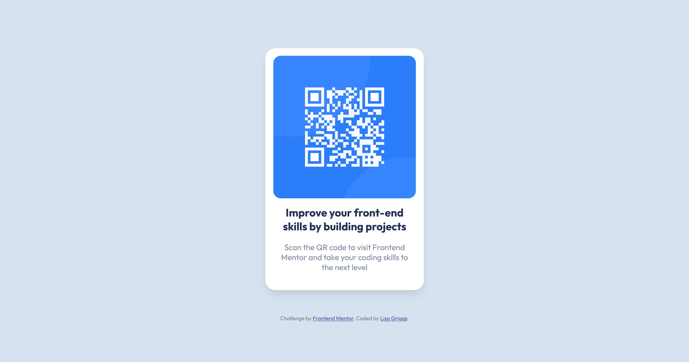

# Frontend Mentor - QR code component solution

This is a solution to the [QR code component challenge on Frontend Mentor](https://www.frontendmentor.io/challenges/qr-code-component-iux_sIO_H). Frontend Mentor challenges help you improve your coding skills by building realistic projects.

## Table of contents

- [Overview](#overview)
  - [Screenshot](#screenshot)
  - [Links](#links)
- [My process](#my-process)
  - [Built with](#built-with)
  - [What I learned](#what-i-learned)
  - [Continued development](#continued-development)
- [Author](#author)

**Note: Delete this note and update the table of contents based on what sections you keep.**

## Overview

Challenge is to build out this QR code component and get it looking as close to the original design as possible.

### Screenshot



### Links

- Solution URL: [Solution](https://www.frontendmentor.io/solutions/qr-code-component-for-desktop-and-mobile-using-flexbox-NJUNvlelqU)
- Live Site URL: [Live Site](https://sprightly-heliotrope-cfbe3f.netlify.app/)

## My process

### Built with

- Semantic HTML5 markup
- CSS custom properties
- Flexbox

### What I learned

Just having started my frontend journey, I have basic knowledge of HTML and CSS and also just started learning Flexbox. Doing this challenge has given me the opportunity to use my current knowledge to apply it as effectively as possible for desktop and also mobile view.

### Continued development

A helpful commenter on Frontend Mentor informed me I should review HTML semantics as I could use 'main' instead of a 'div'. Also, I have taken their advice to use max-width and min-height instead of using one height element originally.

```HTML
<!--HTML original code -->
<div class="container"></div>
```

```HTML
<!--HTML updated code -->
<main></main>
```

```CSS
/* CSS original code */
.container {
    height: 95vh;
}
```

```CSS updated code
/* CSS updated code */
main {
  max-width: 100vw;
  min-height: 100vh;
}
```

## Author

- Frontend Mentor - [@lisagriggs](https://www.frontendmentor.io/profile/lisagriggs)
